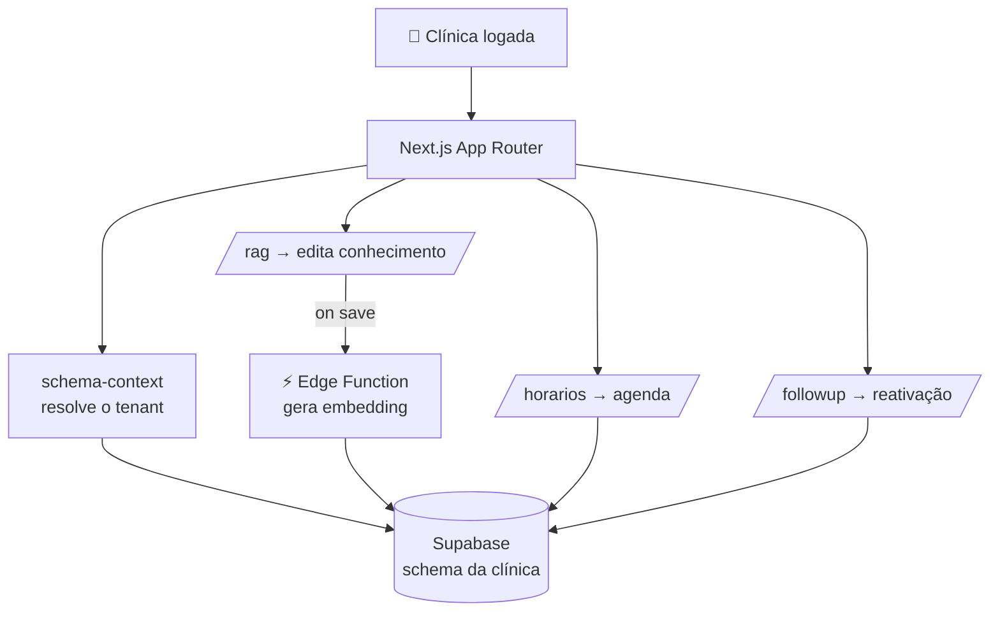

# 🖥️ Dashboard Multi-Clínica

> Painel web onde cada clínica gerencia o próprio agente de IA: edita a **base de conhecimento**, configura **horários**, acompanha **follow-ups** e liga/desliga a IA — tudo isolado por cliente.

> 🔒 **Case anonimizado.** Sem nome de cliente, credenciais ou dados reais.

---

## 🎯 O problema

O agente de IA roda nos bastidores (n8n + banco), mas o **cliente final** (a clínica) não pode mexer em workflow nem em SQL. Ele precisa de uma interface simples pra:

- Atualizar **preços, procedimentos e informações** que a IA usa pra responder.
- Definir **horários** de atendimento.
- Ver o que está acontecendo com os **follow-ups**.
- **Pausar a IA** quando quiser assumir manualmente.

E cada clínica só pode ver e mexer **nos próprios dados** — nunca nos de outra.

## ✅ A solução

Um dashboard em **Next.js (App Router)** sobre **Supabase**, com isolamento **multi-tenant por schema Postgres**:

| Rota | Função |
|---|---|
| `/rag` | Edita a base de conhecimento → dispara a re-vetorização (RAG) |
| `/horarios` | Configura janelas de atendimento e disponibilidade |
| `/followup` | Acompanha os follow-ups automáticos |
| Toggle IA | Liga/desliga o agente sem mexer em workflow |

---

## 🏗️ Arquitetura

---

## 🧩 Destaques técnicos

- **Multi-tenant por schema:** cada clínica vive num schema Postgres próprio (não um filtro de `clinic_id` em linha) — isolamento forte de dados por design. Um `schema-context` resolve qual tenant a sessão acessa.
- **App Router + Server Components:** Next.js moderno, com `redirect` server-side e query string preservada entre rotas.
- **Edição que vira IA:** salvar conteúdo no `/rag` aciona a [Edge Function de embedding](https://github.com/iTristaoo/rag-knowledge-base) — o que a clínica escreve já fica buscável pelo agente.
- **Componentes próprios:** toggle de IA, input de horário, sidebar — UI enxuta focada no que o cliente precisa.
- **Cliente Supabase isolado** em `lib/supabase.ts`, com contexto de schema injetado.

## 🧰 Stack

| Camada | Tecnologia |
|---|---|
| Front | Next.js (App Router) + React + TypeScript |
| Estilo | Tailwind CSS |
| Dados / auth | Supabase (Postgres, schema-per-tenant) |
| Integração | Edge Functions (embedding), n8n (automação) |
| Deploy | Vercel |

## 📈 Resultados

> Exemplos do que medir:
> - 🙌 Autonomia do cliente (atualiza info sem pedir pro time técnico)
> - ⏱️ Tempo pra subir uma clínica nova
> - 🔧 Redução de chamados de suporte

---

## 🔗 Projetos relacionados

- [rag-knowledge-base](https://github.com/iTristaoo/rag-knowledge-base) — o que a edição em `/rag` alimenta
- [ai-followup-automation](https://github.com/iTristaoo/ai-followup-automation) — exibido e controlado em `/followup`
